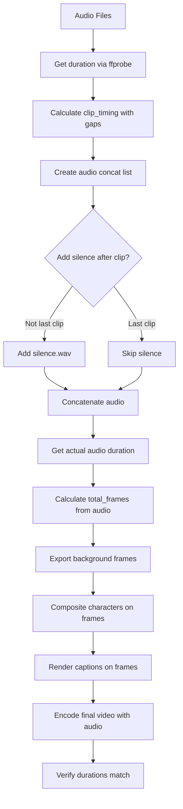

# Implementation Plan: Fix Timing Sync & Background Quality Issues

## Problem Summary

The previous issues (Stewie not showing, background static) are now **FIXED**. However, two new issues have emerged:

1. **Background video quality is poor** - JPG compression artifacts
2. **Character, caption, and audio timing don't match** - Synchronization issues

---

## Root Cause Analysis

### Issue 1: Poor Background Quality

**Location**: [`scripts/assemble_video.py`](scripts/assemble_video.py:122)

```python
f'{frames_dir}/bg_%05d.jpg'  # JPG with default quality
```

**Problem**: 
- Background frames are saved as JPG with **default quality** (75)
- No quality specified when re-encoding frames
- Each frame goes through: Original → JPG decode → composite → JPG encode → final video
- This double compression degrades quality significantly

### Issue 2: Timing Mismatch (Character, Caption, Audio)

**Root Causes**:

#### 2a. Extra Silence at End of Audio
**Location**: [`scripts/assemble_video.py`](scripts/assemble_video.py:181-184)

```python
for audio_path in audio_files_to_concat:
    f.write(f"file '../{audio_path}'\n")
    f.write(f"file 'silence.wav'\n")  # <-- Silence added AFTER EVERY clip including LAST
```

**Problem**: Silence is added after the LAST audio clip too, making audio longer than video frames.

#### 2b. Frame Calculation Rounding
**Location**: [`scripts/assemble_video.py`](scripts/assemble_video.py:130-131)

```python
start_f = int(timing['start'] * FPS)  # Truncates, doesn't round
end_f = int(timing['end'] * FPS)
```

**Problem**: Integer truncation causes up to 1 frame (41ms) timing drift per clip.

#### 2c. Caption Re-encoding Drift
**Location**: [`scripts/add_captions.py`](scripts/add_captions.py:107-116)

```python
final = CompositeVideoClip([video] + caption_clips)
final.write_videofile(temp_output, fps=24, ...)
```

**Problem**: MoviePy re-encodes the entire video, potentially introducing timing shifts.

#### 2d. Caption Chunk Timing
**Location**: [`scripts/add_captions.py`](scripts/add_captions.py:72-76)

```python
chunk_duration = duration / len(chunks)
for ci, chunk in enumerate(chunks):
    chunk_start = start + (ci * chunk_duration)
    chunk_end = chunk_start + chunk_duration
```

**Problem**: Captions are split evenly across duration, but speech doesn't follow even patterns. Words at the end of a sentence are often spoken faster.

---

## Implementation Plan

### Phase 1: Fix Background Quality

#### 1.1 Use PNG Instead of JPG for Intermediate Frames
**File**: [`scripts/assemble_video.py`](scripts/assemble_video.py:122)

```python
# Change from:
f'{frames_dir}/bg_%05d.jpg'

# To:
f'{frames_dir}/bg_%05d.png'
```

#### 1.2 Increase Quality for Final Encoding
**File**: [`scripts/assemble_video.py`](scripts/assemble_video.py:201)

```python
# Change from:
'-c:v', 'libx264', '-preset', 'medium', '-crf', '23',

# To:
'-c:v', 'libx264', '-preset', 'slow', '-crf', '18',  # Lower CRF = higher quality
```

#### 1.3 Alternative: Use High-Quality JPG
If PNG is too slow, use high-quality JPG:

```python
# In ffmpeg export (line 122):
f'{frames_dir}/bg_%05d.jpg'

# Add quality option in ffmpeg:
'-q:v', '2',  # High quality JPG (1-31, lower is better)
```

And when saving composited frames (line 157):
```python
bg_img.convert("RGB").save(bg_path, quality=95)  # Already at 95, good
```

---

### Phase 2: Fix Timing Synchronization

#### 2.1 Remove Extra Silence at End of Audio
**File**: [`scripts/assemble_video.py`](scripts/assemble_video.py:181-184)

```python
# Change from:
with open('output/audio_concat.txt', 'w') as f:
    for audio_path in audio_files_to_concat:
        f.write(f"file '../{audio_path}'\n")
        f.write(f"file 'silence.wav'\n")  # Adds silence after EVERY clip

# To:
with open('output/audio_concat.txt', 'w') as f:
    for i, audio_path in enumerate(audio_files_to_concat):
        f.write(f"file '../{audio_path}'\n")
        # Only add silence AFTER clips, not after the last one
        if i < len(audio_files_to_concat) - 1:
            f.write(f"file 'silence.wav'\n")
```

#### 2.2 Fix Frame Calculation Rounding
**File**: [`scripts/assemble_video.py`](scripts/assemble_video.py:130-131)

```python
# Change from:
start_f = int(timing['start'] * FPS)
end_f = int(timing['end'] * FPS)

# To:
start_f = round(timing['start'] * FPS)
end_f = round(timing['end'] * FPS)
```

#### 2.3 Ensure Total Duration Matches Audio Exactly
**File**: [`scripts/assemble_video.py`](scripts/assemble_video.py:88-89)

```python
# After calculating total_duration, verify it matches the actual audio duration
# Get actual concatenated audio duration
subprocess.run([
    'ffmpeg', '-y', '-f', 'concat', '-safe', '0',
    '-i', 'output/audio_concat.txt',
    '-c', 'copy', 'output/combined_audio.wav'
], check=True, capture_output=True)

# Get actual audio duration
probe = subprocess.run(
    ['ffprobe', '-v', 'error', '-show_entries', 'format=duration', '-of', 'json', 'output/combined_audio.wav'],
    capture_output=True, text=True
)
actual_audio_duration = float(json.loads(probe.stdout)['format']['duration'])

# Use audio duration for video
total_duration = actual_audio_duration
total_frames = int(total_duration * FPS) + 1
```

---

### Phase 3: Fix Caption Timing

#### 3.1 Render Captions Directly on Frames (Same as Characters)
**Best Solution**: Instead of using MoviePy for captions, render them directly on frames during the frame-by-frame compositing phase.

**File**: [`scripts/assemble_video.py`](scripts/assemble_video.py:125-163)

Add caption rendering to the frame compositing loop:

```python
from PIL import Image, ImageDraw, ImageFont

# Load font
try:
    font = ImageFont.truetype("/usr/share/fonts/truetype/dejavu/DejaVuSans-Bold.ttf", 46)
except:
    font = ImageFont.load_default()

# In the frame loop:
for f_idx in range(total_frames):
    bg_path = f"{frames_dir}/bg_{f_idx+1:05d}.png"
    if not os.path.exists(bg_path):
        break
        
    speaker = frame_speakers[f_idx]
    current_time = f_idx / FPS
    
    # Load frame
    bg_img = Image.open(bg_path).convert("RGBA")
    
    # Composite character
    if speaker and speaker in characters:
        char_img = characters[speaker]
        if speaker == 'peter':
            cx = 30
        else:
            cx = CANVAS_W - char_img.width - 30
        bg_img.paste(char_img, (cx, char_y), char_img)
    
    # Find and render caption
    for timing in clip_timing:
        if timing['start'] <= current_time < timing['end']:
            # Calculate which chunk to show
            text = timing['text']
            words = text.split()
            chunk_size = 7
            chunks = [' '.join(words[i:i + chunk_size]) for i in range(0, len(words), chunk_size)]
            
            if chunks:
                duration = timing['end'] - timing['start']
                chunk_duration = duration / len(chunks)
                time_in_clip = current_time - timing['start']
                chunk_idx = min(int(time_in_clip / chunk_duration), len(chunks) - 1)
                chunk = chunks[chunk_idx]
                
                # Render text
                draw = ImageDraw.Draw(bg_img)
                
                # Get text bounding box
                bbox = draw.textbbox((0, 0), chunk, font=font)
                text_width = bbox[2] - bbox[0]
                text_x = (CANVAS_W - text_width) // 2
                text_y = 1050  # Same as caption_y in add_captions.py
                
                # Draw with stroke (outline)
                stroke_width = 3
                # Draw stroke by drawing text multiple times offset
                for ox in range(-stroke_width, stroke_width + 1):
                    for oy in range(-stroke_width, stroke_width + 1):
                        if ox != 0 or oy != 0:
                            draw.text((text_x + ox, text_y + oy), chunk, font=font, fill='black')
                # Draw main text
                draw.text((text_x, text_y), chunk, font=font, fill='yellow')
            break
    
    # Save frame
    bg_img.convert("RGB").save(bg_path, quality=95)
```

#### 3.2 Alternative: Keep MoviePy Captions But Fix Timing
If keeping MoviePy for captions, ensure timing is preserved:

```python
# In add_captions.py, use copy codec for video to avoid re-encoding
final.write_videofile(
    temp_output,
    fps=24,
    codec='libx264',
    audio_codec='copy',  # Copy audio without re-encoding
    preset='medium',
    threads=2
)
```

---

### Phase 4: Add Timing Verification Logging

Add debug output to verify timing alignment:

```python
# After assembling audio
log(f"\n📊 TIMING VERIFICATION:")
log(f"   Video duration: {total_duration:.3f}s ({total_frames} frames)")
log(f"   Audio duration: {actual_audio_duration:.3f}s")

# Check each clip timing
log(f"\n📊 CLIP TIMING:")
for timing in clip_timing:
    log(f"   [{timing['index']}] {timing['speaker']}: {timing['start']:.3f}-{timing['end']:.3f}s "
        f"(frames {round(timing['start']*FPS)}-{round(timing['end']*FPS)})")
```

---

## Summary of Changes

| File | Line | Change | Priority |
|------|------|--------|----------|
| `assemble_video.py` | 122 | Change `.jpg` to `.png` for intermediate frames | High |
| `assemble_video.py` | 201 | Change CRF from 23 to 18 for better quality | High |
| `assemble_video.py` | 181-184 | Don't add silence after last audio clip | Critical |
| `assemble_video.py` | 130-131 | Use `round()` instead of `int()` for frame calculation | Medium |
| `assemble_video.py` | 88-89 | Calculate total_frames from actual audio duration | High |
| `assemble_video.py` | 125-163 | Add caption rendering to frame loop | High |
| `add_captions.py` | Entire file | Can be removed if captions rendered in assemble | Optional |

---

## Testing Plan

1. Run workflow with debug logging
2. Verify:
   - Background quality is improved (no compression artifacts)
   - Audio duration matches video duration exactly
   - Character appears at correct times
   - Captions sync with audio
3. Check timing.json for correct values
4. Play final video and verify sync

---

## Mermaid Diagram: Timing Flow


